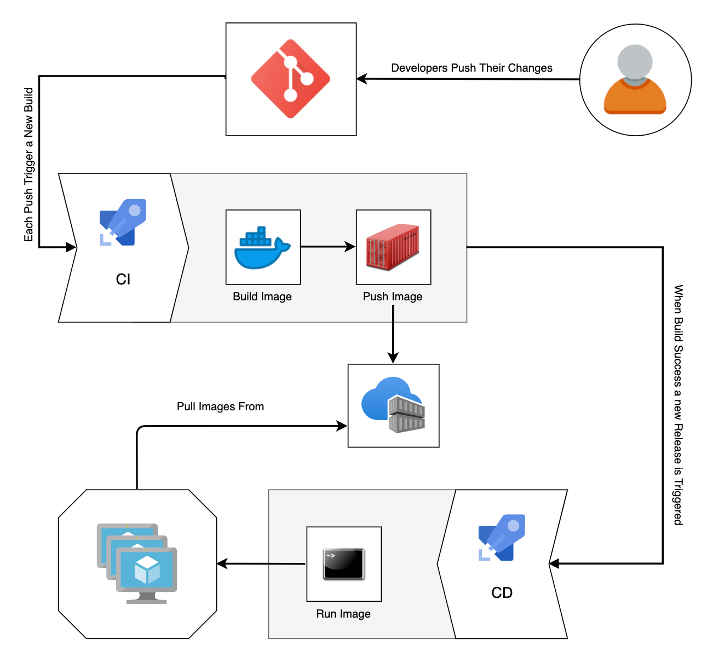

## Weight Tracker App - Container CI-CD

This project consists of writing a Dockerfile to package the WeightTracker application into an image and configure a CI/CD process to automate the deployment.

## CI-CD process requirements:
* **Feature Branch** - Whenever a new change is pushed to a feature branch this should start the CI pipeline that will take the Dockerfile from the repository and builds an image to ensure that everything is ok.

* **Main Branch** - Whenever a new change is pushed to the main branch,CI process starts and takes the Dockerfile from the repository,builds an image and pushes it to a container registry (Azure ACR).
Then the CD consists on pulling the image from the registry and deploying it into the staging environments automatically (Continuous Deployment) and then wait for approval to deploy it into the Production environment (Continuous Delivery).

## Configuration

1. A single pipeline for build and release **ci-cd-pipeline.yml** added .

2. Template file **templates/deploy_template.yml** added to reuse the deployment stage code for each environment.

2. Code is managed with **Feature Branch Workflow**. **Feature** works on the code independently and then the code is integrated into the **Main** branch to be deployed in the target environments.

3. Branch protection rule added to main branch to enforce code review by using pull requests and a build validation policy to ensure that the changes are ok before integrating them.

4. A **Private Azure Container Registry** is used to push the docker images.

5. Ansible is used for deploying the image to the target environments. each environment has an azure DevOps agent that pulls the image from the azure private container registry and starts the container on the web servers.

6. Make docker able to run containers without sudo by adding the agent user to Docker group.

7. A **.dockerignore** file added to prevent adding unnecessary files to the docker image..

